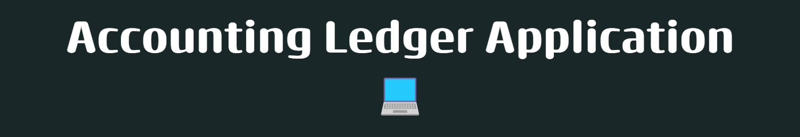

<h1>Project description</h1>
&nbsp;&nbsp;&nbsp;&nbsp;With this CLI application you're able to track financial and personal transactions. From making 
deposits and payments, to tracking up-to-month transactions and many different reports, even a custom search option.

## Key features
* Home screen  
  
&nbsp;&nbsp;&nbsp;&nbsp; o The Home Screen allows you to add deposits, make payments and access the Ledger and quit the application.
* The Ledger  
  
  
&nbsp;&nbsp;&nbsp;&nbsp;  o In the Ledger you have access to displaying all transactions, only deposits, only payments, and gives access to the Reports panel.
* Reports  
  
  
  &nbsp;&nbsp;&nbsp;&nbsp;  o The reports panel has the options to display the month-to-date report, previous month, year-to-date, previous year, search by vendor, custom search and go back to the Ledger panel.
* Custom search  
  
  
  &nbsp;&nbsp;&nbsp;&nbsp;  o The custom search panel allows you to filter transactions by start-date, end-date, description, vendor, and amount of transaction. Your desire transaction will be search and displayed if found.
---
## Interesting pieces of code

* This piece of code is allowing the user to reset the current screen by just pressing enter, or they can input 0 to go
back to the previous screen. If the input is neither of the options it resets the screen.

* If you pass in "Loading", this code will mimic a loading percentage function, it looks very nice before displaying something,
it looks as if it was keeping track of the what's being process.

* when you pass a txt file which has ascii art, this code makes it appear on the terminal as if it was being drawn.
In my case I used to  animate the banners of each screen.